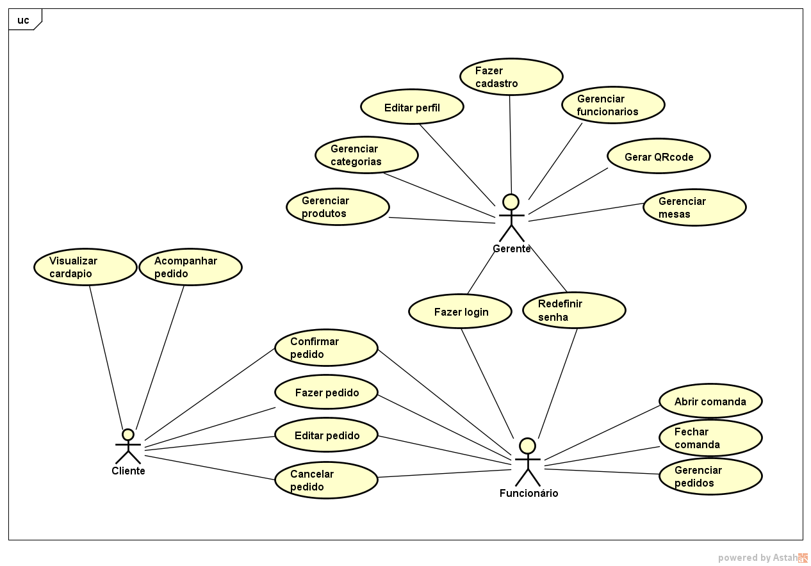
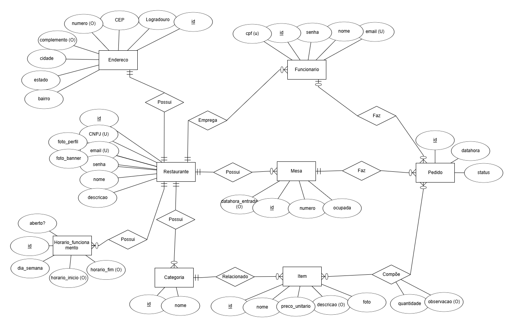
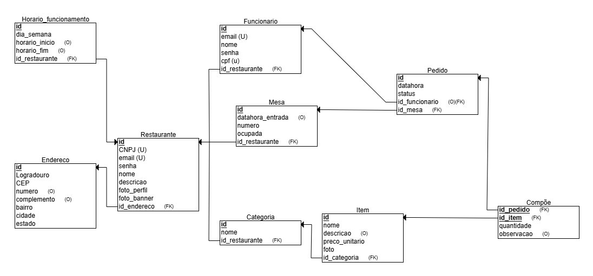
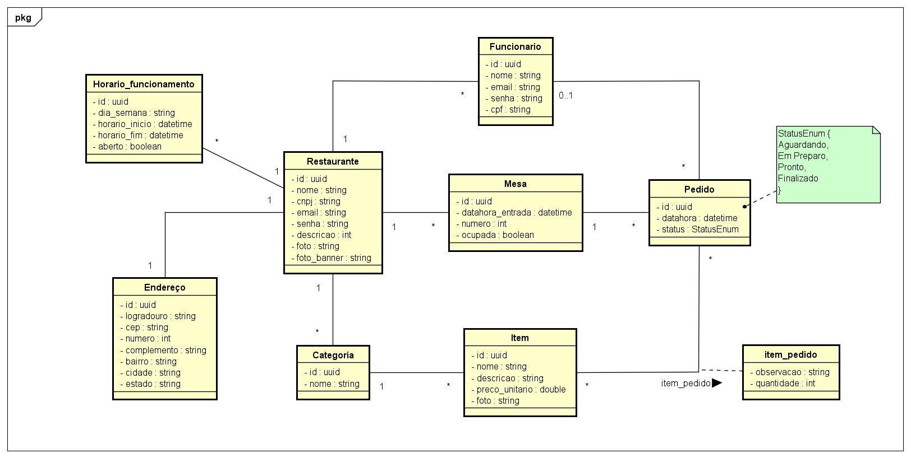

# Diagramas

## Comércio Eletrônico

### Histórico da Revisão 

|  Data  | Versão | Descrição | Autor |
|:-------|:-------|:----------|:------|
| 01/06/2021 | **1.00** | Versão Inicial  | George Azevedo |
| 10/07/2025 | **1.02** | Versão Editada  | Izabel Alice |
| 07/08/2025 | **1.03** | Versão Editada  | Izabel Alice |

## 1. Diagrama de casos de uso 

## 2. Diagrama de entidades e relacionamentos

## 3. Esquema Relacional

## 4. Classe de domínio

